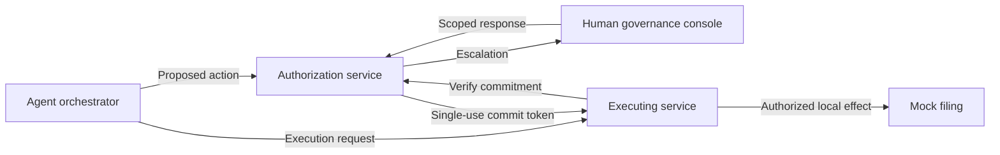

<!-- SPDX-License-Identifier: CC-BY-SA-4.0 -->
# ai-charter-runtime

**Check an AI agent's proposed action before it takes effect.**

ai-charter-runtime is a TypeScript proof of concept that puts authorization checks outside the acting AI model. It explores how an agent can work within recorded permissions, stop when a decision needs human input, and leave a record of what was proposed, authorized, and done.

The working example is a **simulated public-grant assessment**. The agent can propose filing an assessment; a separate authorization service checks the proposal against the recorded mandate, and the executing service verifies permission again before producing a local test effect. A model's answer is never permission to act.

**Current stage:** a runnable local prototype with synthetic tests and browser consoles. The reviewed implementation reaches one local mock effect; live end-to-end capture is still pending. This is a maintainer-built demonstrator, not production-ready software or a certification artifact.

[Explore the example](#what-you-can-explore) · [Run the offline checks](#start-here-offline) · [Read the documentation](docs/README.md) · [Contribute](#contribute)

## What you can explore

| Situation in the synthetic grant scenario | Behavior exercised by the prototype |
|---|---|
| File an assessment within the mandate's limits | Verify the exact proposed action at commitment, produce one local filing effect, and record a receipt. |
| File above the amount ceiling | Refuse the action at the executing service, including when a case officer has approved it. |
| Submit the same committed filing again | Refuse the replay without producing a second effect. |
| Treat an unconfirmed inference as a fact | Stop and route a focused question to the case officer; a bare confirmation is insufficient. |
| Receive a factual correction from the applicant | Append the correction, withdraw or reopen reliance, and record the obligation to route it for review. |

These are fixture-based exercises. The [acceptance ledger](docs/m6/acceptance.md) maps the scenarios and adversarial cases to evidence, with coverage marked **exercised**, **partial**, or **not assessed**.

## How it works

The prototype separates three roles into local processes:



The authorization service owns the rules, mandates, decisions, and records. The orchestrator cannot change standing authority or receive a commit token. Screening-model signals can flag a concern or force escalation; they cannot grant permission.

Five gates organize the action lifecycle:

| Gate | Question it addresses |
|---|---|
| **Authorize** | Is this system and proposed use within the recorded authority? |
| **Submit** | Are the proposed inputs, tools, and disclosures permitted? |
| **Verify** | Does the proposal meet the required checks, or need human intervention? |
| **Commit** | Is this exact action still authorized at the point of commitment? |
| **Rely** | What record can people inspect, rely on, and challenge? |

A gate returns **allow**, **deny**, or **escalate**. Escalation stops the action and routes a bounded decision to the appropriate human role. It does not grant additional authority. Missing or ambiguous authority fails closed.

See the [implementation specification](docs/spec/runtime-gates-poc-spec.md) for the exact contracts and the [architecture decisions](docs/adr/) for protocol details.

## Start here: offline

You need **Node.js 20 or newer**, npm, and Git. Start with the synthetic checks; they require no model API keys or `.env.local` file. Dependency installation needs network access; the checks use synthetic fixtures and local loopback providers.

```powershell
git clone https://github.com/robertschaub/ai-charter-runtime.git
cd ai-charter-runtime
npm ci
npm run typecheck
npm run m6:schemas
npm exec -- vitest run packages/m6-offline/src/m6Offline.test.ts
```

Already have a checkout? Start at `npm ci` in its root directory.

The schema command validates the M6 artifact schemas, committed fixture sources, and generated acceptance ledger; it prints `M6 schemas and committed sources validate.` on success. The final command runs the focused offline conformance tests, including refusals and recovery paths. These checks do not constitute a live model evaluation.

For a reading-first tour, start with the [scenario table](docs/m6/acceptance.md#scripted-beats), then the [test-family coverage](docs/m6/acceptance.md#thirteen-test-families).

<details>
<summary><strong>Advanced: browser consoles and provider probes</strong></summary>

<a id="m4-native-process-boundary"></a>

### Local browser runtime

The interactive runtime needs additional configuration. Copy [.env.local.example](.env.local.example) to the gitignored `.env.local` and configure the distinct role/process credentials, HMAC key pair, and both model-lane API keys. [ADR-002](docs/adr/ADR-002-authenticated-interfaces.md) and [ADR-007](docs/adr/ADR-007-canonicalization-and-keys.md) define the credential and integrity contracts. Never put credentials in source files or records.

```powershell
npm run runtime:start
```

The supervisor starts services, authorization, and the orchestrator in recovery order. The governance console is at `http://127.0.0.1:7801/console` with default settings; the case officer opens the case console through its handoff control. Startup makes no model request, but model-call controls can contact configured providers and incur charges. Use synthetic data only. See the [console documentation](packages/consoles/README.md) for the current interaction boundaries.

Existing local records can be checked with `npm run verify:records -- --local`; this skips the remote-checkpoint-presence step only. Verification starts a run and appends access evidence, so it is not a read-only inspection.

<a id="m0-probe"></a>

### Provider capability probe

`npm run probe` contacts the configured model APIs and writes gitignored results to `docs/m0-probe-results.json`. It is an optional maintainer operation, not an onboarding step. Agents need explicit maintainer approval for live probes, key generation/rotation, and card signing; see [AGENTS.md](AGENTS.md). Historical endpoint findings are in the [M0 probe memo](docs/m0-probe-memo.md).

</details>

## Status and limits

M4 and the bounded M5 milestone are complete. M6.1–M6.3 add synthetic screening exercises, native commitment continuation, and offline conformance. **M6.4 live capture has not started.** Exact reviewed revisions and remaining work are in the [implementation plan](docs/implementation-plan.md); [M4](docs/m4-acceptance.md), [M5](docs/m5-acceptance.md), and [M6.3](docs/m6/acceptance.md) have separate acceptance records.

<a id="honest-limits--read-this-first"></a>

- **Mechanism, not institutional independence.** Rulemaker, operator, and record keeper are played by one demo operator. An independent reviewer and remedy decider are absent. Separate local processes do not establish independent oversight.
- **Bounded evidence.** Tests show how declared rules are applied to synthetic cases; they do not establish that the rules are lawful, fair, or legitimate. Semantic screening remains partial or not assessed, and model signals can be wrong.
- **Commitment has a defined boundary.** Authority binds at `commit-verify`; revocation during the token's short remaining lifetime is too late for that action under this design. Post-commit reversal or compensation is not implemented. Later corrections append evidence rather than overwrite earlier outcomes, including a terminal `no-effect` reconciliation.
- **Prototype infrastructure.** Authentication is demo-grade. Hash chains, HMAC, and checkpoints bound but do not eliminate rollback risk; independent record custody remains future work. Provider-reported model identity cannot prevent provider-side substitution.

See the [full specification limits](docs/spec/runtime-gates-poc-spec.md#9-non-goals-and-honest-limits) and [NOTICE](NOTICE). There is no certification, assurance credential, or trust score here.

## Relationship to Our AI Charter and EGA

This repository demonstrates the [Our AI Charter](https://github.com/robertschaub/our-ai-charter) runtime reference model and provides technical preparation for [Evidence-Gated Agents (EGA)](https://github.com/robertschaub/our-ai-charter/blob/main/docs/Assurance/Concepts/evidence-gated-agents.md). EGA plans to reuse compatible gates, proposal bindings, commitment verification, and receipts around an agent's exact proposed decision, with FactHarbor providing a separate live evidence examination. **That integration is not implemented and remains subject to funding.**

The authoritative [Runtime specification](docs/spec/runtime-gates-poc-spec.md), its [system-use companion](docs/spec/system-use-decision-record.md), and ADRs live here beside the code. On divergence, the specification and its linked Charter sources prevail. EGA-specific contract changes require separate review and adoption.

<a id="layout-and-status"></a>

## Find your way around

| Area | Start here |
|---|---|
| Documentation and reading paths | [Documentation index](docs/README.md) |
| Authorization, mandates, and records | [Gate core](packages/gate-core/) |
| Model connections | [Adapters](packages/adapters/) |
| Local action execution | [Mock services](packages/services-mock/) |
| Orchestrator and browser consoles | [Consoles](packages/consoles/) |
| Offline conformance | [M6 offline runner](packages/m6-offline/) and [acceptance ledger](docs/m6/acceptance.md) |
| Synthetic inputs and model evidence | [Fixtures](fixtures/) and [model cards](docs/cards/) |

## Contribute

Useful contributions include clearer examples, reproducible build problems, challenges to the stated limits, and proposals for the Runtime specification or ADRs. Open a [public issue](https://github.com/robertschaub/ai-charter-runtime/issues) for these; report gate bypasses, record-integrity findings, and exposed secrets through the [private security route](SECURITY.md).

Before submitting work, read [Contributing](CONTRIBUTING.md) and the [agent and development rules](AGENTS.md). Original software and synthetic fixtures use **AGPL-3.0-only**; original documentation and graphics use **CC BY-SA 4.0**. See the [licensing guide](LICENSING.md) for scope, third-party exceptions, and alternative licensing. The [privacy notice](PRIVACY.md) remains a draft for review.

The full contributor suite is `npm test`. On 3 October 2026, 427 tests passed and three process tests failed at mandate creation (HTTP 422 instead of 201). Source inspection points to the default [demo system-use decision](fixtures/demo/system-use-decision.json), which expired on 30 September, while those tests use the current clock; this explanation has not been isolated by reproduction. The focused offline checks above pass with their fixed synthetic timeline. The process-test failure remains open; this documentation update does not renew an approval or change runtime behavior.
